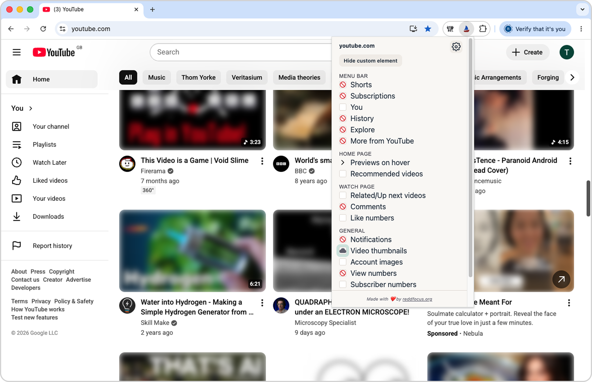
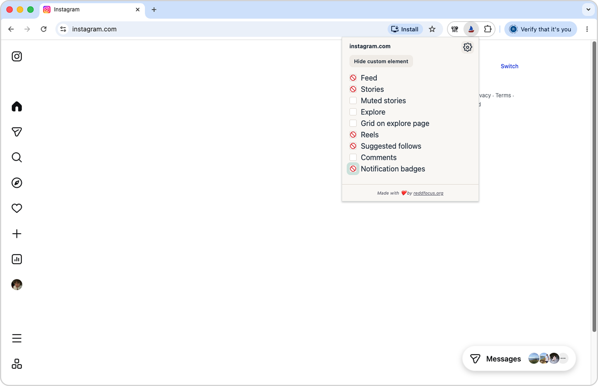
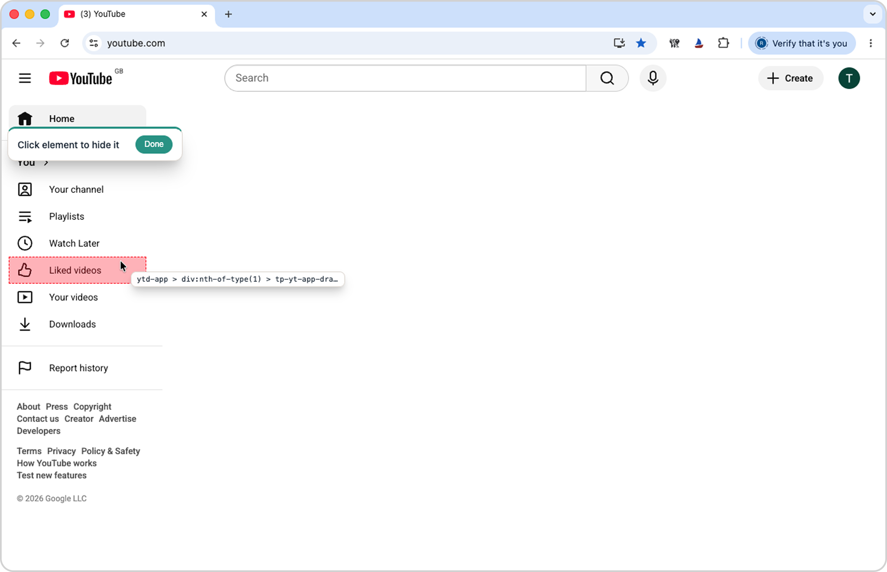
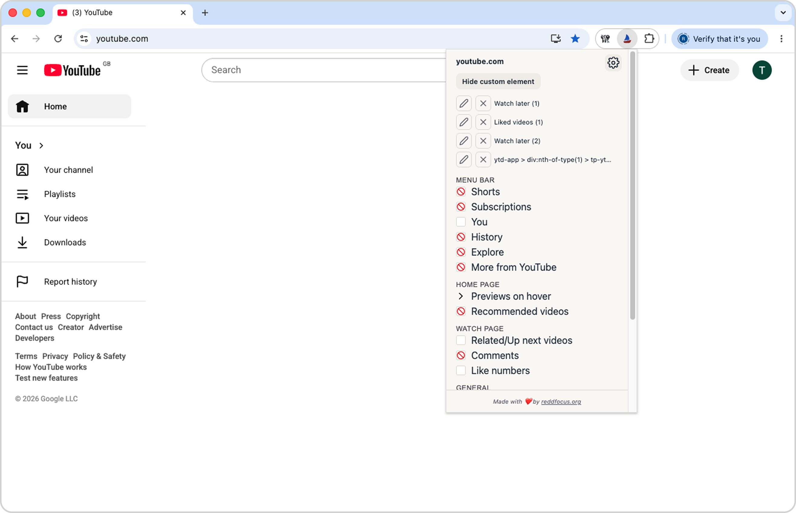

# ReDD Focus

**Plain sailing in the distracting digital world**

  

Source code for the Safari, Chrome, and Firefox extension **ReDD Focus**, available for Mac, iOS, and other devices.

**Hide distractions on any website** (e.g., YouTube, Instagram, LinkedIn, Google Search, etc.). Works on any website in any browser, with pre-configured options for popular platforms.

ReDD Focus is **open source**, developed by the [Centre for Digital Habit](https://digitalhabits.org), and [backed by research](https://arxiv.org/pdf/2001.04180.pdf).

## Features

- Works on any website, with built-in options for YouTube, Facebook, Twitter, Instagram, LinkedIn, Google Search, and WhatsApp Web  
- Hide any distracting element with a single click  
- Cross-browser support (Safari, Chrome, Firefox)  
- Lightweight and privacy-friendly

## Demo

## Screenshots

  
  

  
  

## Installation

- **[Chrome Web Store](https://chromewebstore.google.com/detail/redd-focus-hide-distracti/hhblkhfdjijdinijakbmcpkmdfhoadcd?hl=en-GB)**
- **[Firefox Add-ons](https://addons.mozilla.org/en-GB/firefox/addon/reddfocus/)**  
- **[Apple App Store](https://apps.apple.com/gb/app/mindshield/id1660218371)**  

## iOS Usage Tip

On mobile Safari, you can create shortcuts to open distracting websites directly in the browser (bypassing their apps) and then delete the apps from your device. Example for iPhone:  

1. Open the **Shortcuts** app.  
2. Create a new shortcut (**+** button).  
3. Search for the **Open URL** action and enter, e.g., `https://www.instagram.com`.  
4. Tap the **Share** icon in the top-right and select **Add to Home Screen**.  

## Development

To run this locally:  

1. Install Xcode  
2. Clone or download the repository  
3. Open the project in Xcode  
4. Click the **Play** button  
